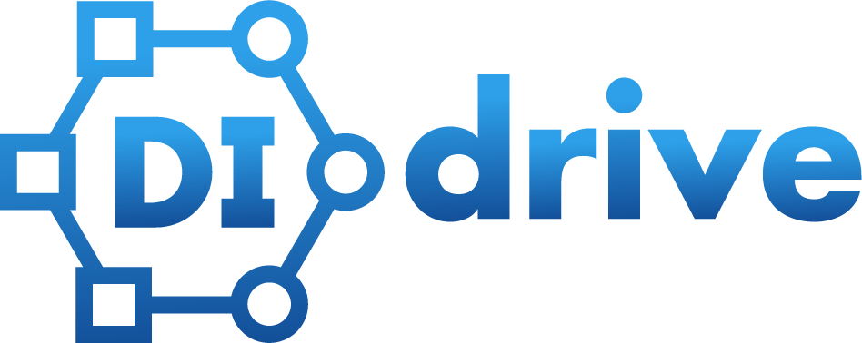

# DI-drive

Updated on 2021.11.18 DI-drive-v0.2.1 (beta)

DI-drive - Decision Intelligence Platform for Autonomous Driving simulation.

DI-drive is application platform under [OpenDILab](http://opendilab.org/)

## Introduction

**DI-drive** is an open-source application platform under **OpenDILab**. DI-drive applies different simulator/datasets/cases in **Decision Intelligence** Training & Testing for **Autonomous Driving** Policy.
It aims to

- run Imitation Learning, Reinforcement Learning, GAIL etc. in a single platform and simple unified entry
- apply Decision Intelligence in any parts of driving simulation
- suit most of the driving simulators input & output
- run designed driving cases and scenarios

and most importantly, to **put these all together!**

**DI-drive** uses [DI-engine](https://github.com/opendilab/DI-engine), a Reinforcement Learning
platform to build most of the running modules and demos. **DI-drive** currently supports [Carla](http://carla.org),
an open-source Autonomous Drining simualtor to operate driving simualtion.

## Installation

**DI-drive** needs to run [Carla](http://carla.org) server for simulation. Besides, The client needs to have the following modules installed:

- Pytorch
- DI-engine
- Carla Python API

Please refer to the [documentation](https://opendilab.github.io/DI-drive/) for details about installation and user guide of **DI-drive**.
We provide IL and RL tutorials, and full guidance for quick run existing policy for beginners.

Please refer to [FAQ](https://opendilab.github.io/DI-drive/faq/index.html) for frequently asked questions.

## Model Zoo

### Imitation Learning

- [Conditional Imitation Learning](https://arxiv.org/abs/1710.02410)
- [Learning by Cheating](https://arxiv.org/abs/1912.12294)
- [from Continuous Intention to Continuous Trajectory](https://arxiv.org/abs/2010.10393)

### Reinforcement Learning

- BeV Speed RL
- [Implicit Affordance](https://arxiv.org/abs/1911.10868)
- [Latent DRL](https://arxiv.org/abs/2001.08726)

## DI-drive Casezoo

**DI-drive Casezoo** is a scenario set for training and testing of Autonomous Driving policy in simulator.
**Casezoo** combines data collected by real vehicles and Shanghai Lingang road license test Scenarios.
**Casezoo** supports both evaluating and training, whick makes the simulation closer to real driving.

Please see [casezoo instruction](docs/casezoo_instruction.md) for details about **Casezoo**.

## Contributing

We appreciate all contributions to improve DI-drive, both algorithms and system designs.

## License

DI-engine released under the Apache 2.0 license.

## Citation

@misc{didrive,
    title={{DI-drive: OpenDILab} Decision Intelligence platform for Autonomous Driving simulation},
    author={DI-drive Contributors},
    publisher = {GitHub},
    howpublished = {\url{`https://github.com/opendilab/DI-drive`}},
    year={2021},
}
