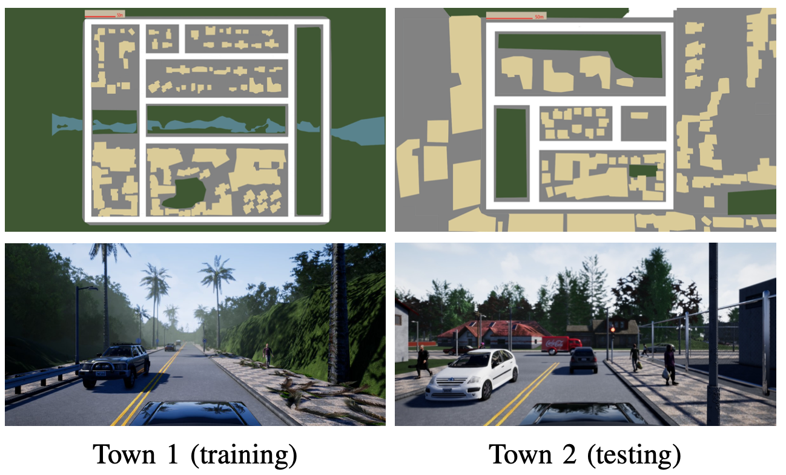

Benchmark Evaluation
#####################

.. toctree::
    :maxdepth: 2

DI-drive provides hands-on benchmark environment settings :sup:`[1]` for Carla simulator. The benchmark setting consists of several suites. 
Each suite contains a town map, several kind of weather, num of other vehicles and pedestrians, and a `.txt` file which 
provides routes' start and target waypoints. The standard benchmark evaluation provides three kinds of routes in 'town1'
and 'town2', which are 'straight', 'turn' and 'full'. For example, *FullTown01-v2* refers to an evaluation suite in town1 and 'full'
routes. Other settings like weathers and NPCs are defined by the number of version. Some suites are aliased for convenience,
for example *town1* represents all commonly used suites in 'town1'.

Carla benchmark setting is widely used in other literature as training and evaluation standard.
DI-drive allows users to quickly build up an environment with a benchmark suite setting by deploying
:class:`BenchmarkEnvWrapper <core.envs.carla_env_wrapper.BenchmarkEnvWrapper>`. Once an environment is wrapped, it will ignore
the passed arguments in ``reset`` method, and choose one from the suite's route list according to aonfiguration. It can be used
in RL training, to sampling data in benchmark environment settings.

Also, DI-drive deploys :class:`CarlaBenchmarkEvaluator <core.eval.carla_benchmark_evaluator.CarlaBenchmarkEvaluator>` and
:class:`CarlaBenchmarkCollector <core.data.carla_benchmark_collector.CarlaBenchmarkCollector>` to run with a policy
and a ``EnvManager`` in DI-engine that can run several environments in parallel. They can parse reset params in the provided
suite to a list and run all the episodes in order.
The ``Evaluator`` is used to evaluate a policy by running an amount or the entire benchmark suits,
for example, run 50 or 100 routes in `FullTown02-v2` suite to test its successful rate
in the suite. The ``Collector`` is used to sample episodes to make IL datasets.

.. note::

    Check these modules in `API doc <../api_doc/index.html>`_ for detail information.

Sample images
------------------

You can check routes in each benchmark suite file in `benchmark <../../../data/benchmark>`_ and find start & end waypoint.
Here we show benchmark settings for 'Town01' and 'Town02':sup:`[2]`.

    
    Road maps od Town01 and Town02

.. figure:: ../../figs/weathers.png
    :alt: weathers
    :align: center
    :width: 600px
    
    Weather settings for train, test and eval

Performance Metrics
---------------------

- CILRS

=============   =============   =========   ========    
Suite           Success rate    Total run   Seed
=============   =============   =========   ========
FullTown01-v1   70%             70/100      0
FullTown02-v1   99%             99/100      0
=============   =============   =========   ========

.. - MME2E

.. =============   ==============  =========   ========
.. Suite           Success rate    Total run   Seed
.. =============   ==============  =========   ========
.. FullTown01-v1   39%             39/100      0
.. FullTown01-v2   34%             17/50       0
.. FullTown01-v3   44%             44/100      0
.. FullTown01-v4   30%             15/50       0
.. =============   ==============  =========   ========

.. - LBC cheating

.. =============   ==============  =========   ========
.. Suite           Success rate    Total run   Seed
.. =============   ==============  =========   ========
.. FullTown01-v1   100%            100/100     0
.. FullTown01-v2   100%            50/50       0
.. FullTown01-v3   99%             99/100      0
.. FullTown01-v4   100%            50/50       0
.. FullTown02-v1   100%            100/100     0
.. FullTown02-v2   98%             49/50       0
.. FullTown02-v3   100%            100/100     0
.. FullTown02-v4   100%            50/50       0
.. =============   ==============  =========   ========

.. - LBC Image

.. =============   ==============  =========   ========
.. Suite           Success rate    Total run   Seed
.. =============   ==============  =========   ========
.. FullTown01-v1   98%             99/100      0
.. FullTown01-v2   100%            50/50       0
.. FullTown01-v3   97%             97/100      0
.. FullTown01-v4   100%            50/50       0
.. FullTown02-v1   98%             98/100      0
.. FullTown02-v2   96%             48/50       0
.. FullTown02-v3   96%             96/100      0
.. FullTown02-v4   100%            50/50       0
.. =============   ==============  =========   ========

- Implicit Affordance (single lane)

=============   ==============  =========   ========
Suite           Success rate    Total run   Seed
=============   ==============  =========   ========
FullTown01-v1   100%            50/50       0
FullTown01-v2   100%            50/50       0
FullTown01-v3   90%             45/50       0
FullTown01-v4   86%             43/50       0
=============   ==============  =========   ========

- Implicit Affordance (multi lane)

===================   ==============  =========   ========
Suite                 Success rate    Total run   Seed
===================   ==============  =========   ========
FullTown04-v1         42%             21/50       0
FullTown04-v2         42%             21/50       0
FullTown04-v3         42%             21/50       0
FullTown04-v4         50%             25/50       0
ChangeLaneTown04-v1   92%             46/50       0
ChangeLaneTown04-v2   92%             46/50       0
===================   ==============  =========   ========

- Simple RL DQN

=============   ==============  =========   ========
Suite           Success rate    Total run   Seed
=============   ==============  =========   ========
FullTown01-v1   92%             23/25       0
FullTown01-v2   88%             22/25       0
FullTown02-v1   80%             20/25       0
FullTown02-v2   72%             18/25       0
=============   ==============  =========   ========

.. - MfDRL

.. =============   ==============  =========   ========
.. Suite           Success rate    Total run   Seed
.. =============   ==============  =========   ========
.. FullTown01-v1   54%             54/100      0
.. FullTown01-v2   54%             27/50       0
.. FullTown01-v3   36%             36/100      0
.. FullTown01-v4   24%             12/50       0
.. FullTown02-v1   54%             54/100      0
.. FullTown02-v2   64%             32/50       0
.. FullTown02-v3   37%             37/100      0
.. FullTown02-v4   42%             21/50       0
.. =============   ==============  =========   ========

Reference
------------

| [1] J  Hawke, et al. `"Urban Driving with Conditional Imitation Learning." <http://vladlen.info/papers/conditional-imitation.pdf>`_ (2019).
| [2] Xiao, Y. , et al. `"Multimodal End-to-End Autonomous Driving." <https://arxiv.org/abs/1906.03199v1>`_ (2019).
