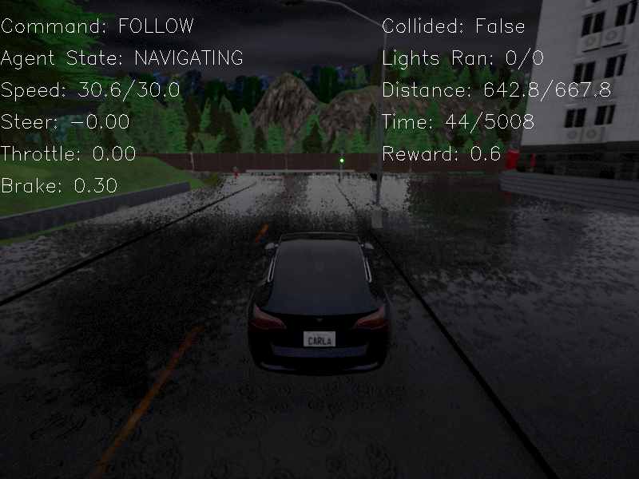

Visualization
###############

.. toctree::
    :maxdepth: 2

DI-drive builds an online visualizer for the user to check the situation of a running simulator and save gif/video files. The
visualizer is added in the environment's :func:`render <core.envs.BaseDriveEnv.render>`. When calling this method, if
a visualizer is created by config settings, it will take a sensor data as canvas and put some info text onto it, including
actions, road options, agent state, reward, traffic light records and so on. Then
the canvas can be showed in the screen or saved as a gif or video file to watch.
A visualizer can be customized by config.

.. code:: python

    visualizer = dict(
        type=None,
        show_text=True,
        outputs=list(),
        save_dir='',
        frame_skip=0,
    )

- type
    The observation tag in simulator config's ``obs`` key. Visualizer use it as a canvas image.
- show_text
    Whether to add text above the image. Text information is found in observation or action dict.
- outputs
    Output types of visualizer, can be one or more items of ['show', 'gif', 'video']
- save_dir
    Folder path to save visualized files.
- frame_skip
    The number of frames skipped between two steps when visualizing. For example, if set to 2, the painting and showing
    will be run every 3 frames.

Here we show some visualization results. You can check how to get these visualizations in `auto run <../tutorial/auto_run.html>`_

    Visualization of RGB camera

.. figure:: ../../figs/auto_run_bev.png
    :alt: auto_run_bev
    :align: center
    :width: 500px

    Visualization of Bird-eye View image

There is also another visualization method using ``gym.wrappers.Monitor`` to record the visualized
canvas returned by ``render`` method of an environment, and make video using ``ffmpeg`` lib.
This can be switched on by calling ``enable_save_replay`` of an env manager. The visualization
video and logs will be recorded in the provided folder path.

.. code:: python

    my_env = BaseEnvManager(env_fn, cfg.enb.manager)
    my_env.enable_save_replay(cfg.env.replay_path)

.. note::

    If you are using your own env class, be careful dealing with env instance when using visualization
    with 'enable_save_replay'.
