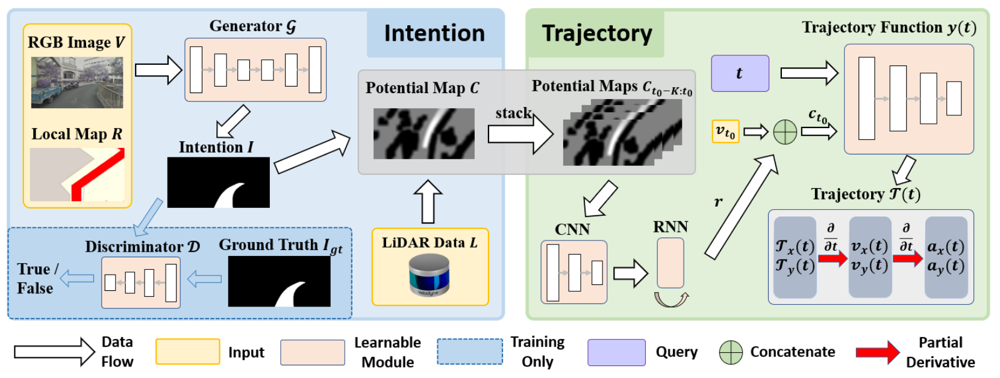

from Continuous Intention to Continuous Trajectory
#######################################################

.. toctree::
    :maxdepth: 2

`from Continuous Intention to Continuous Trajectory(CICT) <https://arxiv.org/abs/2010.10393>`_
is a hierarchical Imitation Learning method for close-loop autonomous driving. It uses a generator
network to obtain potential map from RGB camera and LiDAR inputs, and then uses a trajectory function
network to generate a detailed trajectory together with the placement.

DI-drive prepares training and evaluation for the GAN network and trajectory network in CICT. The IL
datasets is colleted via Carla. The close-loop control test is supported using the two trained networks.

Data Preparation
==================

The collection settings can be modified in ``demo/cict_demo/post.py``. By default we collect 40
episodes in total, 37 for training and 3 for evaluation.
You may need to change the environment num, episode num, server ip and port and dataset path
in default config before running.

Default settings:

.. code:: python

    config = dict(
        env=dict(
            env_num=5,
            simulator=dict(
                disable_two_wheels=True,
                waypoint_num=32,
                planner=dict(
                    type='behavior',
                    resolution=1,
                ),
                obs=(
                    dict(
                        name='rgb',
                        type='rgb',
                        size=[640, 360],
                        position=[0.5, 0.0, 2.5],
                        rotation=[0, 0, 0],
                        sensor_tick=1. / 30,
                    ),
                    dict(
                        name='lidar',
                        type='lidar',
                        channels=64,
                        range=50,
                        points_per_second=100000,
                        rotation_frequency=30,
                        upper_fov=10,
                        lower_fov=-30,
                        position=[0.5, 0.0, 2.5],
                        rotation=[0, 0, 0],
                        sensor_tick=0.05,
                    )
                ),
                verbose=True,
            ),
            col_is_failure=True,
            stuck_is_failure=True,
            manager=dict(
                auto_reset=False,
                shared_memory=False,
                context='spawn',
                max_retry=1,
            ),
            wrapper=dict(suite='FullTown01-v3', ),
        ),
        server=[
            dict(carla_host='localhost', carla_ports=[9000, 9010, 2]),
        ],
        policy=dict(
            target_speed=25,
            noise=False,
            collect=dict(
                n_episode=5,
                dir_path='datasets/cict_datasets_train',
                npy_prefix='_preloads',
                collector=dict(suite='FullTown01-v3', ),
            ),
        ),
    )

Collecting and post processing:

.. code:: bash

    python collect_data.py

Training
=============
CICT is a two-stage method. ``cict_train_GAN.py`` and ``cict_train_traj.py`` are used for training of each stage.
You may need to change the dataset path and pre-train model path.

Default Configuration of the first stage:

.. code:: python

    train_config = dict(
        NUMBER_OF_LOADING_WORKERS=4,
        IMG_HEIGHT=128,
        IMG_WIDTH=256,
        SENSORS=dict(rgb=[3, 360, 640]),
        DEST=0, #choose bird-view destination (0) or camera-view destination (1)
        START_EPISODE=0, #set which episodes for training
        END_EPISODE=37,
        BATCH_SIZE=32,
        COMMON=dict(
            folder='sample', exp='cict_GAN', dataset_path='datasets'
        ),
        GPU='0',
        SAVE_INTERVAL=1000,
        MAX_CKPT_SAVE_NUM=40,
        N_EPOCHS=60,
        SPEED_FACTOR=25.0,
        TRAIN_DATASET_NAME='cict_datasets_train',
        MODEL_TYPE='cict_GAN',
        PREFIX='_preloads',
        UNPAIRED=False,
        GAN=False,
        MODEL_CONFIGURATION=dict(
            generator=dict(
                down_channels=[6, 64, 128, 256, 512, 512, 512, 512],
                up_channels=[0, 512, 512, 512, 256, 128, 64],
                kernel_size=4,
                stride=2,
                padding=1,
                down_norm=[False, True, True, True, True, True, False],
                up_norm=[True, True, True, True, True, True],
                down_dropout=[0, 0, 0, 0.5, 0.5, 0.5, 0.5],
                up_dropout=[0.5, 0.5, 0.5, 0, 0, 0],
                final_channels=1,
                num_branches=1,
            ),
            discriminator=dict(
                channels=[7, 64, 128, 256, 512],
                kernel_size=4,
                stride=2,
                padding=1,
                norm=[False, True, True, True],
                dropout=[0, 0, 0, 0]
            )
        ),
        PRE_TRAINED=False,
        LEARNING_RATE=0.0003,
        BETA1=0.5,
        BETA2=0.999,
        GAN_LOSS_FUNCTION='MSE',
        PIXEL_LOSS_FUNCTION='L1',
        PIXEL_LOSS_WEIGHT=2,
        PRELOAD_MODEL_ALIAS=None,
        PRELOAD_MODEL_BATCH=None,
        PRELOAD_MODEL_CHECKPOINT=None,
        REMOVE=None,
    )

Training the first stage:

.. code:: bash

    python cict_train_GAN.py

Default Configuration of the second stage:

.. code:: python

    train_config = dict(
        NUMBER_OF_LOADING_WORKERS=4,
        IMG_HEIGHT=200,
        IMG_WIDTH=400,
        MAX_DIST=25.,
        MAX_T=1,
        IMG_STEP=1,
        PRED_LEN=10,
        START_EPISODE=0,
        END_EPISODE=37,
        BATCH_SIZE=64,
        COMMON=dict(
            folder='sample', exp='cict_traj', dataset_path='datasets'
        ),
        GPU='0',
        EVAL=False,
        SAVE_INTERVAL=1000,
        MAX_CKPT_SAVE_NUM=40,
        N_EPOCHS=80,
        SPEED_FACTOR=25.0,
        TRAIN_DATASET_NAME='cict_datasets_train',
        MODEL_TYPE='cict_traj',
        PREFIX='_preloads',
        MODEL_CONFIGURATION=dict(
            input_dim=1,
            hidden_dim=256,
            out_dim=2
        ),
        PRE_TRAINED=False,
        LEARNING_RATE=3e-4,
        WEIGHT_DECAY=5e-4,
        VELOCITY_LOSS_WEIGHT=1,
        ACCELERATION_LOSS_WEIGHT=0.1,
        PRELOAD_MODEL_ALIAS=None,
        PRELOAD_MODEL_BATCH=None,
        PRELOAD_MODEL_CHECKPOINT=None,
        REMOVE=None,
    )

Training the second stage:

.. code:: bash

    python cict_train_traj.py

Evaluation
============
``cict_eval_GAN.py`` and ``cict_eval_traj.py`` are used for training of each stage.
Note that you must evaluate the first stage before evaluate the second stage.
Also you may need to change the dataset path and pre-train weights path.

Default configuration of the first stage:

.. code:: python

    eval_config = dict(
        NUMBER_OF_LOADING_WORKERS=1,
        IMG_HEIGHT=128,
        IMG_WIDTH=256,
        SENSORS=dict(rgb=[3, 360, 640]),
        DEST=0,
        START_EPISODE=37,
        END_EPISODE=40,
        BATCH_SIZE=1,
        COMMON=dict(
            folder='sample', exp='cict_GAN', dataset_path='datasets'
        ),
        GPU='0',
        TRAIN_DATASET_NAME='cict_datasets_train',
        MODEL_TYPE='cict_GAN',
        PREFIX='_preloads',
        UNPAIRED=False,
        MODEL_CONFIGURATION=dict(
            generator=dict(
                down_channels=[6, 64, 128, 256, 512, 512, 512, 512],
                up_channels=[0, 512, 512, 512, 256, 128, 64],
                kernel_size=4,
                stride=2,
                padding=1,
                down_norm=[False, True, True, True, True, True, False],
                up_norm=[True, True, True, True, True, True],
                down_dropout=[0, 0, 0, 0.5, 0.5, 0.5, 0.5],
                up_dropout=[0.5, 0.5, 0.5, 0, 0, 0],
                final_channels=1,
                num_branches=1,
            )
        ),
        GAN_LOSS_FUNCTION='MSE',
        PIXEL_LOSS_FUNCTION='L1',
        PRELOAD_MODEL_ALIAS=None,
        PRELOAD_MODEL_BATCH=None,
        PRELOAD_MODEL_CHECKPOINT=None,
        REMOVE=None,
    )

Evaluating the first stage:

.. code:: bash

    python cict_eval_GAN.py

Default configuration of the second stage:

.. code:: python

    eval_config = dict(
        NUMBER_OF_LOADING_WORKERS=1,
        IMG_HEIGHT=200,
        IMG_WIDTH=400,
        MAX_DIST=25.,
        MAX_T=1,
        IMG_STEP=1,
        START_EPISODE=37,
        END_EPISODE=40,
        BATCH_SIZE=1,
        PRED_LEN=10,
        COMMON=dict(
            folder='sample', exp='cict_traj', dataset_path='datasets'
        ),
        GPU='0',
        SPEED_FACTOR=25.0,
        TRAIN_DATASET_NAME='cict_datasets_train',
        MODEL_TYPE='cict_traj',
        PREFIX='_preloads',
        EVAL=True,
        MODEL_CONFIGURATION=dict(
            input_dim=1,
            hidden_dim=256,
            out_dim=2
        ),
        PRELOAD_MODEL_ALIAS=None,
        PRELOAD_MODEL_BATCH=None,
        PRELOAD_MODEL_CHECKPOINT=None,
        REMOVE=None,
    )

Evaluating the second stage:

.. code:: bash

    python cict_eval_traj.py

Results
=========

The ground-truth potential map and predicted potential map on evaluation dataset at the first stage:

.. image:: ../../figs/result_GAN.png
   :alt: result_GAN
   :align: center

The MSE loss of position, velocity, and acceleration on evaluation dataset at the second stage:

==================    =========
position loss         0.00024
velocity loss         0.44275
acceleration loss     3.52583
==================    =========

Benchmark Evaluating
=======================

The Benchmark evaluation runs with the two trained network in a Carla town suite. You may need to
change the environment num, server IP and port and suite's name in config.

Default configuration:

.. code:: python 

    eval_config = dict(
        env=dict(
            env_num=5,
            simulator=dict(
                verbose=False,
                disable_two_wheels=True,
                waypoint_num=32,
                obs=(
                    dict(
                        name='rgb',
                        type='rgb',
                        size=[640, 360],
                        position=[0.5, 0.0, 2.5],
                        rotation=[0, 0, 0],
                    ),
                    dict(
                        name='lidar',
                        type='lidar',
                        channels=64,
                        range=50,
                        points_per_second=100000,
                        rotation_frequency=30,
                        upper_fov=10,
                        lower_fov=-30,
                        position=[0.5, 0.0, 2.5],
                        rotation=[0, 0, 0],
                    )
                ),
                planner=dict(type='behavior', resolution=1),
            ),
            col_is_failure=True,
            stuck_is_failure=True,
            manager=dict(
                shared_memory=False,
                auto_reset=False,
                context='spawn',
                max_retry=1,
            ),
        ),
        server=[
            dict(carla_host='localhost', carla_ports=[9000, 9010, 2])
        ],
        policy=dict(
            target_speed=25,
            eval=dict(
                evaluator=dict(
                    suite='FullTown01-v1',
                    episodes_per_suite=5,
                    transform_obs=True,
                ),
            ),
        ),
    )

    policy_config = dict(
        model=dict(
            gan_ckpt_path='_logs/sample/cict_GAN/checkpoints/3000.pth',
            traj_ckpt_path='_logs/sample/cict_traj/checkpoints/65000.pth'
        ),
        SAVE_DIR='vis',
        IMG_HEIGHT=128,
        IMG_WIDTH=256,
        SENSORS=dict(rgb=[3, 360, 640]),
        DEST=0,
        SPEED_FACTOR=25.0,
        MODEL_CONFIGURATION=dict(
            generator=dict(
                down_channels=[6, 64, 128, 256, 512, 512, 512, 512],
                up_channels=[0, 512, 512, 512, 256, 128, 64],
                kernel_size=4,
                stride=2,
                padding=1,
                down_norm=[False, True, True, True, True, True, False],
                up_norm=[True, True, True, True, True, True],
                down_dropout=[0, 0, 0, 0.5, 0.5, 0.5, 0.5],
                up_dropout=[0.5, 0.5, 0.5, 0, 0, 0],
                final_channels=1,
                num_branches=1,
            ),
            traj_model=dict(
                input_dim=1,
                hidden_dim=256,
                out_dim=2
            )
        ),
        MAX_DIST=25.,
        MAX_T=1,
        IMG_STEP=1,
        PRED_LEN=10,
        DT=0.1,
        PRED_T=3
    )

Evaluating on the Carla Benchmark:

.. code:: bash

    python cict_eval.py

Testing with visualization:

.. code::

    python cict_test.py

.. code::

    @ARTICLE{9361054,
        author={Wang, Yunkai and Zhang, Dongkun and Wang, Jingke and Chen, Zexi and Li, Yuehua and Wang, Yue and Xiong, Rong},
        journal={IEEE Robotics and Automation Letters}, 
        title={Imitation Learning of Hierarchical Driving Model: From Continuous Intention to Continuous Trajectory}, 
        year={2021},
        volume={6},
        number={2},
        pages={2477-2484},
        doi={10.1109/LRA.2021.3061336}
    }

 