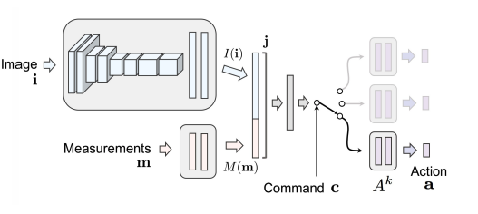

Conditional Imitation Learning
===================================

.. toctree::
    :maxdepth: 2

`CILRS <https://arxiv.org/abs/1904.08980>`_ together with some other implementations 
following `Conditional Imitation Learning(CIL) <https://arxiv.org/abs/1710.02410>`_ is
a commonly used imitation learning method for auto-driving in Carla. It is an end-to-end
driving pipeline which takes front RGB camera and vehicle speed as inputs, then predict
vehicle control signals including steer, throttle and brake under certain navigation
command.

The CIL model uses CNN to capture visual information and concat it with measurements
information (vehicle speed), then use the provided navigation command to select a
branch to give predictions.

   
   CIL model structure

CILRS uses deeper ResNet model and predicts speed in outputs as well to get better
imitating behavior. 

.. figure:: ../../figs/image-cilrs_2.png
   :alt: image-cilrs_2
   :align: center
   :width: 600px

   CILRS model structure

**DI-drive** supports full pipeline of CILRS, including datasets collecting, model
training, and benchmark evaluation. Quick start of CILRS has been
introduced in the tutorial. All code in this page can be found in ``./demo/cilrs``

Data collection
---------------

The configuration of dataset collection has been set up in
``cilrs_data_collect.py``. It uses ``CarlaBenchmarkCollector`` and ``BenchmarkDatasaver``
to collect training data. You can custom the configuration as follow.

.. code:: python

    config = dict(
        env=dict(
            env_num=5,
            simulator=dict(
                disable_two_wheels=True,
                waypoint_num=32,
                planner=dict(
                    type='behavior',
                    resolution=1,
                ),
                obs=(
                    dict(
                        name='rgb',
                        type='rgb',
                        size=[800, 600],
                        position=[2.0, 0.0, 1.4],
                        rotation=[-15, 0, 0],
                    ),
                ),

            ),
            col_is_failure=True,
            stuck_is_failure=True,
            manager=dict(
                auto_reset=False,
                shared_memory=False,
                context='spawn',
                max_retry=1,
            ),
            wrapper=dict(),
        ),
        server=[
            dict(carla_host='localhost', carla_ports=[9000, 9010, 2]),
        ],
        policy=dict(
            target_speed=25,
            noise=True,
            collect=dict(
                n_episode=5,
                dir_path='./datasets_train/cils_datasets_train',
                collector=dict(
                    suite='FullTown01-v1',
                ),
            )
        ),
    )

Model training
--------------

The training of CILRS is a standard imitation learning process. It takes
RGB image and measurement as input then mimic the export label. You can custom
the training by changing model architecture, learning rate, steps and so
on in ``cilrs_train.py``

.. code:: python

    train_config = dict(
        exp_name='cilrs_train',
        policy=dict(
            cuda=True,
            cudnn=True,
            resume=False,
            ckpt_path=None,
            model=dict(
                num_branch=4,
            ),
            learn=dict(
                epoches=200,
                batch_size=128,
                loss='l1',
                lr=1e-4,
                speed_weight=0.05,
                control_weights=[0.5, 0.45, 0.05],
            ),
            eval=dict(
                eval_freq=10,
            )
        ),
        data=dict(
            train=dict(
                root_dir='cilrs_datasets_train',
                preloads='_preloads/cilrs_train.npy',
                transform=True,
            ),
            val=dict(
                root_dir='cilrs_datasets_val',
                preloads='./_preloads/cilrs_val.npy',
                transform=True,
            ),
        )
    )

Model evaluation
----------------

DI-drive supports model evaluation with Carla benchmark. To custom the
evaluation process, you can modify the configuration in ``cilrs_eval.py``.

.. code:: python

    cilrs_config = dict(
        env=dict(
            env_num=5,
            simulator=dict(
                town='Town01',
                disable_two_wheels=True,
                verbose=False,
                planner=dict(
                    type='behavior',
                    resolution=1,
                ),
                obs=(
                    dict(
                        name='rgb',
                        type='rgb',
                        size=[400, 300],
                        position=[1.3, 0.0, 2.3],
                        fov=100,
                    ),
                ),
            ),
            wrapper=dict(),
            col_is_failure=True,
            stuck_is_failure=True,
            manager=dict(
                auto_reset=False,
                shared_memory=False,
                context='spawn',
                max_retry=1,
            ),
        ),
        server=[dict(carla_host='localhost', carla_ports=[9000, 9010, 2])],
        policy=dict(
            ckpt_path=None,
            model=dict(
                num_branch=4,
                pretrained=False,
            ),
            eval=dict(
                evaluator=dict(
                    suite=['FullTown01-v1'],
                    transform_obs=True,
                ),
            )
        ),
    )

We provide pre-train weights that can achieve 90% success rate in single lane maps
(Town01 and Town02). You can use it to run evaluation or fintuning your trained models.

`best_ckpt.pth <http://opendilab.org/download/DI-drive/cilrs/best_ckpt.pth>`_

.. code:: 

   @inproceedings{2018End,
     title={End-to-End Driving Via Conditional Imitation Learning},
     author={ Codevilla, Felipe  and  Miiller, Matthias  and  Lopez, Antonio  and  Koltun, Vladlen  and  Dosovitskiy, Alexey },
     booktitle={2018 IEEE International Conference on Robotics and Automation (ICRA)},
     year={2018},
   }

   @inproceedings{codevilla2019exploring,
     title={Exploring the limitations of behavior cloning for autonomous driving},
     author={Codevilla, Felipe and Santana, Eder and L{\'o}pez, Antonio M and Gaidon, Adrien},
     booktitle={Proceedings of the IEEE/CVF International Conference on Computer Vision},
     pages={9329--9338},
     year={2019}
   }
