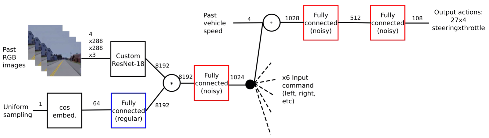

End-to-End Model-Free Reinforcement Learning for Urban Driving using Implicit Affordances 
###########################################################################################

.. toctree::
    :maxdepth: 2

.. role:: code-bash(code)
    :language: shell

`Implicit Affordances <https://arxiv.org/abs/1911.10868>`_ is an end-to-end auto driving
policy trained with Supervised Learning as well as Reinforcement Learning. It first trains
backbone network with some implicit information as label, then freezes the backbone network
and train the head of network using RL.
It takes 4-frame RGB captured by front camera as in put. The model of the two training stage
is shown as follow.

.. figure:: ../../figs/implicit2.png
    :alt: implicit2
    :align: center
    :width: 600px

    SL training pipeline



    RL training pipeline

We extend and modified some of the training and environment details to make *Implicit
Affordances* able to run in multi-lane maps in Carla. This is so far the **first** driving
policy to run `FullTown` navigation in Carla using Reinforcement Learning. It achieves the
same performance as in single-lane maps.

Training Models
================
1. Start one or more CARLA server instances

2. Prepare dataset for supervised leanring

    .. code:: shell

        python collect_data.py

    Something you need to modify in the config of ``collect_data.py``:

    - save_dir: the root dir of dataset
    - server: your Carla servers' ip and port
    - env_num: how many subprocesses(envs) to use for collecting data

3. Pre-train the encoder in a supervised way

    .. code:: shell

        python train_sl.py

    Something you need to modify in ``train_sl.py``:

    - gpus: the list of gpus
    - log_dir: save log and models
    - dataset_dir: the root dir of dataset

4. Train the agent with reinforcement Learning, the log and models will be saved in ``./log``

    .. code:: shell

        python train_rl.py --supervised_model_path /path/to/supervised_model.pth \
        --crop-sky

    Something you need to modify in ``train_rl.py``:

    - train_host_ports: your Carla servers' ip and port for training
    - val_host_ports: your Carla servers' ip and port for evaluation
    - env_num: how many subprocesses(envs) to use for training
    - town: if you want to train agents in the environment with multiple lanes, it can be set to Town04. Otherwise, it can be set to Town01 or Town02

Benchmarking models
===================
1. Make dirs

.. code-block:: bash

    mkdir [MODEL_PATH] && cd [MODEL_PATH]
    mkdir model_supervised
    mkdir model_RL
    
2. Copy the pre-train model into ``[MODEL_PATH]/model_supervised`` and copy the rl model into ``[MODEL_PATH]/model_RL``

3. Run

    .. code:: shell

        python eval.py --crop-sky --path-folder-model [MODEL_PATH]

    Something you need to modify in ``eval.py``:

    - server: your Carla servers' ip and port
    - suit: set the maps and routes for testing (ex. town2, StraightTown01, ChangeLaneTown04)
    - env_num: how many subprocesses(envs) to use for evaluting
    
Evaluation
==========

Running CARLA Server
--------------------

With Display
````````````

.. code:: shell

   ./CarlaUE4.sh --world-port=2000 -opengl # If you run multiple servers at one time, you should modify the world port

Without Display
```````````````

.. code:: shell

   SDL_VIDEODRIVER=offscreen SDL_HINT_CUDA_DEVICE=0 ./CarlaUE4.sh --world-port=2000 -opengl
    # If you run multiple servers at one time, you should modify the world port

Evaluation for Town01
---------------------

.. code:: shell

   cd demo/implicit
   wget http://opendilab.org/download/DI-drive/implicit/models_town01.tar.gz
   tar xvf models_town01.tar.gz
   python eval.py --crop-sky --path-folder-model models_town01

Evaluation for Town04
---------------------

.. code:: shell

   cd demo/implicit
   wget http://opendilab.org/download/DI-drive/implicit/models_town04.tar.gz
   tar xvf models_town04.tar.gz
   python eval.py --crop-sky --path-folder-model models_town04 # 

Something you need to modify in ``eval.py``:

-  server: your Carla servers' ip and port

-  suit: set the maps and routes for testing (ex. town2, StraightTown01,
   ChangeLaneTown04)

-  env_num: how many subprocesses(envs) to use for evaluting

Results
--------------

You can go to `Benckmark page <https://opendilab.github.io/DI-drive/features/carla_benchmark.html>`_
to see results of the two provided pre-train weights.

Training Cost
=============

1. Collect data: about 48Carla / hours
2. Pre-train the encoder: about 4 gpu (32G V100) / days
3. Train the agent(Single Lane): about 60Carla (32G V100) / days
4. Train the agent(Multiple Lanes): about 100Carla (32G V100) / days
