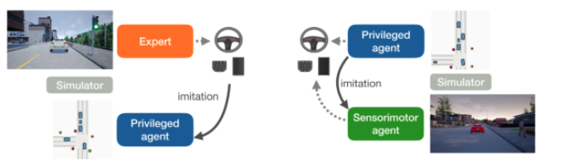

Learning by Cheating
==========================

`Learning by Cheating(LBC) <https://arxiv.org/abs/1912.12294>`_
is an Imitation Learning method which driving in Carla using waypoint prediction and
two-stage training -- cheating model and target model. The cheating model takes
ground-truth Bird-eye View(BeV) image as input to teach the RGB input target policy.
The prediction of the model is a waypoint list then the waypoint list is processed by
a PID controller to get the final control singals including steer,
throttle and brake.

   LBC structure

**DI-drive** provide complete pipeline of training an LBC priviledged model and target
model, including data collection, birdview model training, image model training, mimicing
cheating model and evaluation. All entries can be found in ``demo/lbc``

Datasets collection
-------------------

**DI-drive** provides benchmark data collection for LBC. The dataset is formated to save
rgb data as `.png` files and BeV data into `.lmdb` files. The configuration of dataset
collection is set up in ``lbc_collect_data.py``. You can custom the configuration as
follow.

.. code:: python

    config = dict(
        env=dict(
            env_num=5,
            simulator=dict(
                disable_two_wheels=True,
                planner=dict(
                    type='lbc',
                    resolution=1,
                    threshold_before=7.5,
                    threshold_after=5.,
                ),
                obs=(
                    dict(
                        name='rgb',
                        type='rgb',
                        size=[384, 160],
                        position=[2.0, 0.0, 1.4],
                        fov=90,
                    ),
                    dict(
                        name='birdview',
                        type='bev',
                        size=[320, 320],
                        pixels_per_meter=5,
                        pixels_ahead_vehicle=100,
                    ),
                ),
                verbose=True,
            ),
            col_is_failure=True,
            stuck_is_failure=True,
            wrapper=dict(),
            manager=dict(
                auto_reset=False,
                shared_memory=False,
                context='spawn',
                max_retry=1,
            ),
        ),
        server=[
            dict(carla_host='localhost', carla_ports=[5000, 5010, 2]),
        ],
        policy=dict(
            target_speed=25,
            lateral_dict={'K_P': 0.75, 'K_D': 0., 'K_I': 0.05, 'dt': 0.1},
            longitudinal_dict={'K_P': 0.5, 'K_D': 0.1, 'K_I': 0.025},
            noise=True,
            noise_kwargs=dict(),
            collect=dict(
                dir_path='./datasets_train/lbc_datasets_train',
                n_episode=100,
                collector=dict(
                    suite='FullTown01-v1',
                    nocrash=True,
                ),
            ),
        ),
    )

You may need to change the Carla server numbers and ports, and dataset path to yours.

.. code:: bash

    python collect_data.py

Model training 
--------------

The training of LBC model contains 3 stages: training priviledged model, offline
trainging target model, on-line fine-tuning target model.

Training priviledged model
******************************

The training of priviledged model is a supervide learning procedure. You can check
the training code in ``lbc_birdview_train.py``. By default it will save checkpoint
and tensorboard logs in ``./log``. You can check the training progress and effects.

.. code::

    python lbc_birdview_train.py

Offline training target model
********************************

Pending

Model evaluation
----------------

DI-drive provides benchmark evaluation for both cheating model and target model,
together with pretrain weights. You may need to change the Carla server settings
to yours.

Pretrain weights: 
`bev <http://opendilab.org/download/DI-drive/lbc/birdview/model-256.th>`_, 
`image <http://opendilab.org/download/DI-drive/lbc/rgb/model-20.th>`_

.. code:: shell

    python lbc_bev_eval.py
    python lbc_image_eval.py

Then you will get the performance table.

Model testing
-----------------

DI-drive provides a simple entry for testing LBC models in a benchmark or Casezoo
environment and visualize the running. You may need to change the Carla server settings
to yours.

.. code:: shell

    python lbc_bev_test.py
    python lbc_image_test.py

.. code:: 

   @inproceedings{chen2019lbc,
     author    = {Dian Chen and Brady Zhou and Vladlen Koltun and Philipp Kr\"ahenb\"uhl},
     title     = {Learning by Cheating},
     booktitle = {Conference on Robot Learning (CoRL)},
     year      = {2019},
   }
