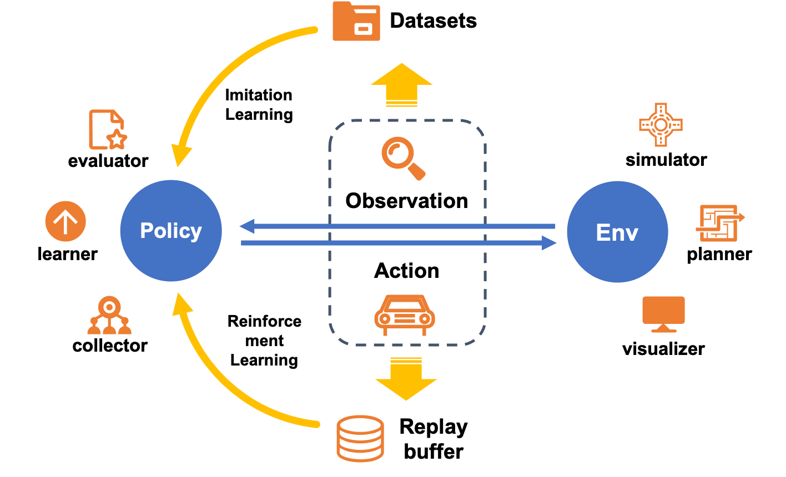

Core Concepts and Processes
################################

DI-drive decomposes Autonomous Driving framework into two parts: **Policy** and **Env**.
Policy maps observations to agent actions, and Env simulates the world with an 
output of new observations. Thus, the simulation iterates and information can be used
to update models, visualize environments and evaluate policies.

One policy can have different running modes, in order to be suitable for varies kinds
of functions in Deep Learning. DI-drive defines 3 modes in policy: collect, eval and learn,
together with **collector**, **evaluator** and **learner** to interact.
DI-drive supports the policy to be any part of the entire procedure
of Autonomous Driving including perception, decision, planning,
controlling, etc., each of which can be a neural network or else.

Env follows the standard definition in Reinforcement Learning. DI-drive use the most
commonly defined environment form in `gym <https://github.com/openai/gym>`_ as well as
the modified version in DI-engine.
Env contains a **simulator** to interact with, and have some other modules to process reward
calculation, success judgement and so on. **Planner** is used to get a navigation route for
vehicle to follow. It also involves lane selection and collision avoidance. **Visualizer**
can help to review and analyze running status of hero vehicle and environments. It can get
a rendering image and instant display of running parameters.

All general Deep Learning methods in Autonomous Driving can be operated with these
modules. The core engine is the rolling of observation-action flow. **Imitation Learning**
can be represented as sampling data and storing to a **dataset**, then using data to train NN
in policy. **Reinforcement Learning** similarly sampling data into **replay buffer** and updating
policy immediately or laterly. Other methods such IRL and GAIL can be promoted from these
modules.
