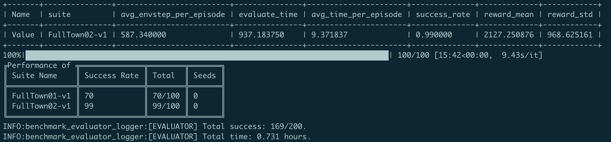

.. _header-n2:

Simple Imitation Learning
==========================

.. toctree::
    :maxdepth: 2

Here we will show you how to use **DI-drive** for imitation learning research
of autopilot. **DI-drive** supports 
`Conditional Imitation Learning(CIL) <http://vladlen.info/papers/conditional-imitation.pdf>`_
and its inheritor for Imitation Learning research.

In this tutorial, we will show how to use **DI-drive** to train a CILRS model.
CILRS takes front RGB camera and vehicle speed as input, then output the prediction of vehicle control singals including
steer, throttle and brake under certain navigation command, together with a speed prediction.

Imitation Learning normally includes three parts:

-  Collecting expert driving datasets

-  Training driving model

-  Close-loop evaluation under driving curcumstance

For now, we will show you step by step. All demo codes can be found in ``demo/cilrs``

.. _header-n14:

Datasets collection
---------------------

To collect expert data, the first step is to start Carla servers

.. code:: shell

   ./CarlaUE4.sh -fps=10 -benchmark -world-port=[PORT NUM]

To customize your training datasets, please refer to the configuration and entry demo in
``cilrs_data_collect.py``. It use an auto-driving policy to run in Carla benchmark 'suite'.
For this tutorial, you need to change the suite name, dataset path and Carla server host/port.

.. code:: python

    server=[
        dict(carla_host='localhost', carla_ports=[9000, 9010, 2]),
    ],
    policy=dict(
        collect=dict(
            n_episode=100,
            dir_path='path_to_your_dataset',
            collector=dict(
                suite='suite_name',
            ),
        )
    )

Then you can use the python scrips to collect the data.

.. code:: shell

   python cilrs_data_collect.py

This collecting process of 100 episodes may cost ~7 hours and ~12 G storage with
single Carla server. You can speed up this process by starting multi-carla servers.

The dataset format is illustrated in the `benchmark datasets <../features/datasets.html>`_.
The CILRS demo builds preload files to speed up the loading of dataset. If you finished
this step, there should be an ``.npy`` file under ``_preloads``.

We recommend to collect both training and validating datasets with different suite to get
better performance.

Once you finish the data collection, the next step is to train an CILRS model.

.. _header-n26:

Model training
--------------

The training part of IL enables a model to mimic the
output of an expert policy with the same input. To apply the model training
with **DI-drive** with default training configuration, just run

.. code:: 

   python cilrs_train.py

Note that you should modify the dataset path and preload path as you have created
above.

.. code:: python

    data=dict(
        train=dict(
            root_dir='path_to_your_train_dataset',
            preloads='path_to_your_train_preloads',
            transform=True,
        ),
        val=dict(
            root_dir='path_to_your_val_dataset',
            preloads='path_to_your_val_preloads',
            transform=True,
        ),

You will see training procedure shown on the screen like this.

.. figure:: ../../figs/image-il_1.png
   :alt: image-il_1
   :align: center
   :width: 600px

The training checkpoints will be saved under ``checkpoints`` folder. The
training process will last for 7~8 hours (i7-9900k and GeForce RTX 2080Ti), up to your machine hardware.

if you want to customize your training configuration such as the model architecture and
learning rates, please modify the config in ``cilrs_train.py``

.. _header-n35:

Model evaluation
----------------

We provide benchmark evaluation and close-loop test in environment (mostly for visualization) for
a trained CILRS model with **DI-drive**. To evaluate your trained model, just run

.. code:: bash

   python cilrs_eval.py 

Note that you may need to change the checkpoint path and Carla server host/port in ``cilrs_eval.py``.

.. code:: python

    server=[
       dict(carla_host='localhost', carla_ports=[9000, 9010, 2])
    ],
    policy=dict(
        ckpt_path='path_to_your_ckpt',
        ...
    )

When the evaluation is finished, you will get a performance table.

Also, you can visual the real-time close-loop test by running

.. code:: python

   python cilrs_test.py 

You can see a visualized screen of the running policy.

.. figure:: ../../figs/image-il_3.png
   :alt: image-il_3
   :align: center
   :width: 500px

You can customize the evaluation and test configuration by modifying the config in 
``cilrs_eval.py`` and ``cilrs_test.py``

Congratulations! You have finished the imitation learning tutorial.
